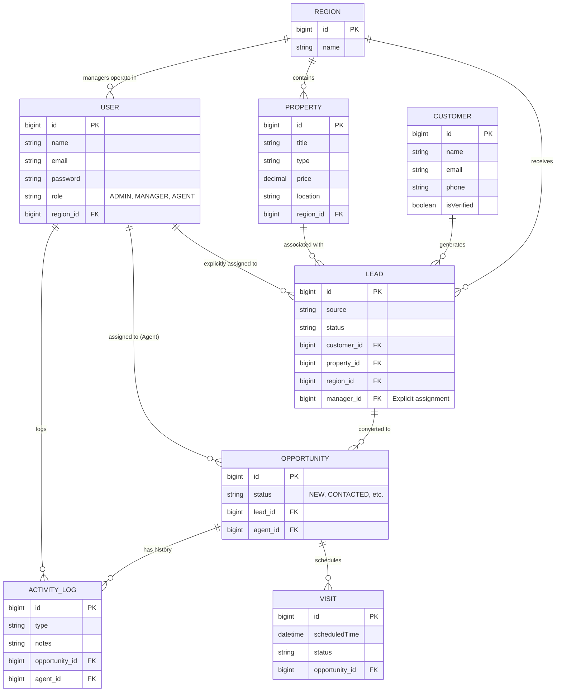
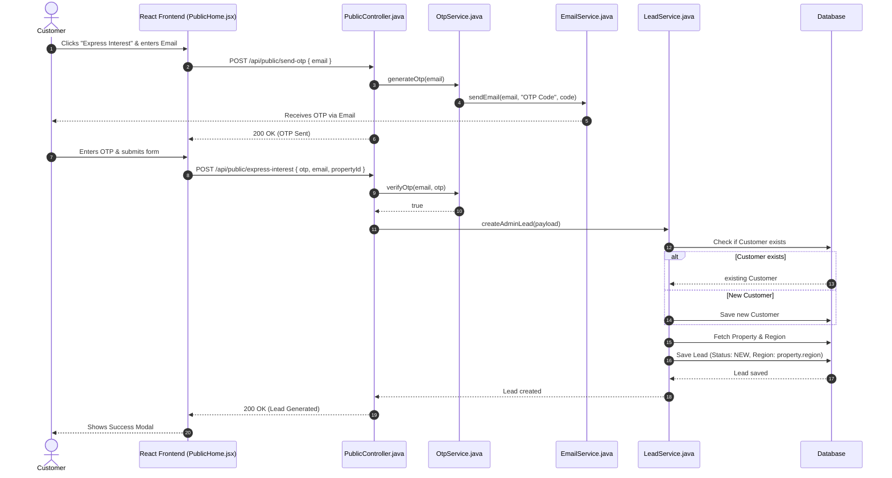
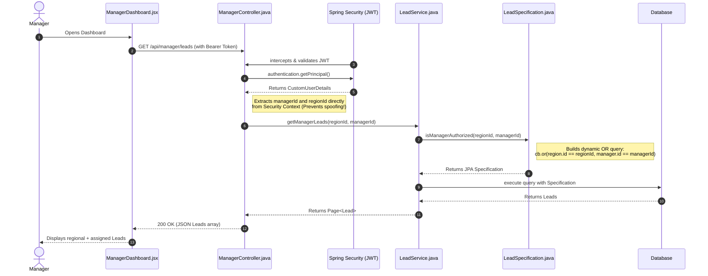
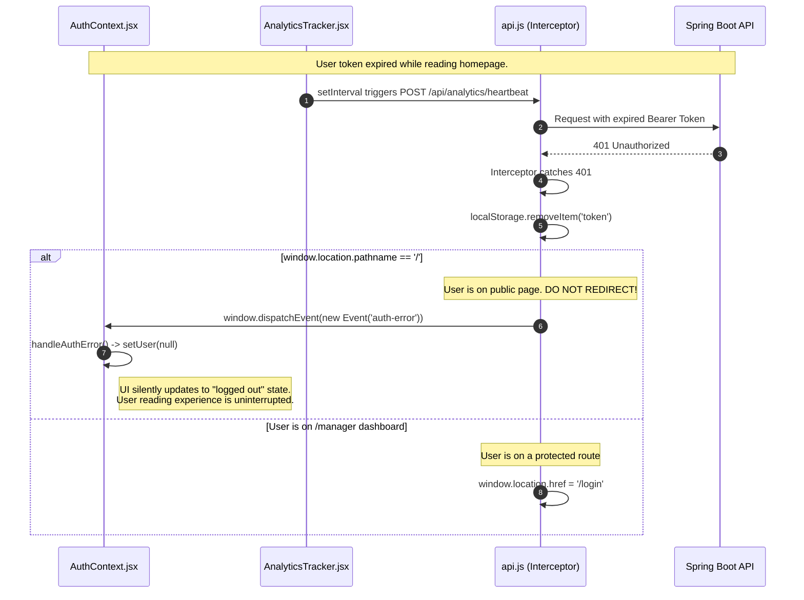

# EstateSync CRM Architecture Diagrams

This document contains visual diagrams mapping out the database relationships and execution flows for critical scenarios in the EstateSync CRM system.

## 1. Entity-Relationship (ER) Diagram

This diagram visualizes the relational database schema, highlighting how entities interact.

---

## 2. Execution Flow: Lead Generation (Public)

This sequence diagram maps out what happens when a public user expresses interest in a property, including OTP verification.

---

## 3. Execution Flow: Manager Assignment Logic

This diagram details the complex backend query logic when a Manager fetches their dashboard, showcasing how `LeadSpecification.java` filters the data.

---

## 4. Execution Flow: The Token Expiration Rescue (Axios Interceptors)

This flow illustrates the custom resilience logic built into the frontend to handle background heartbeat failures without ruining the UX for public users.

