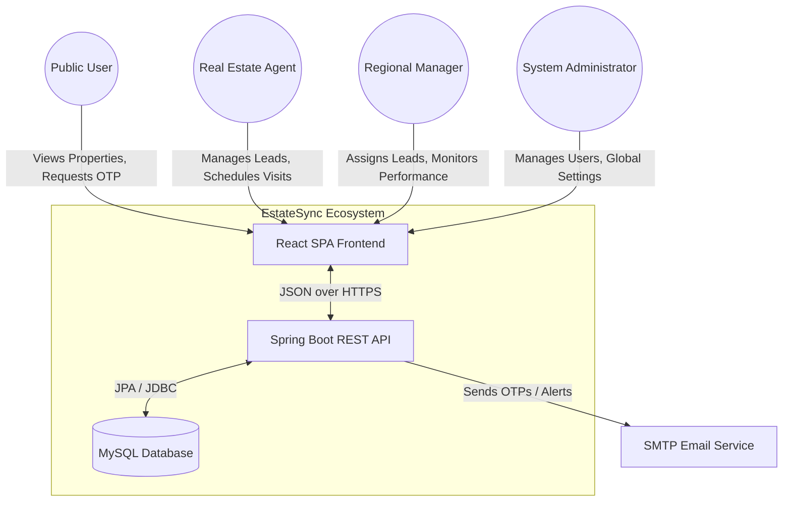
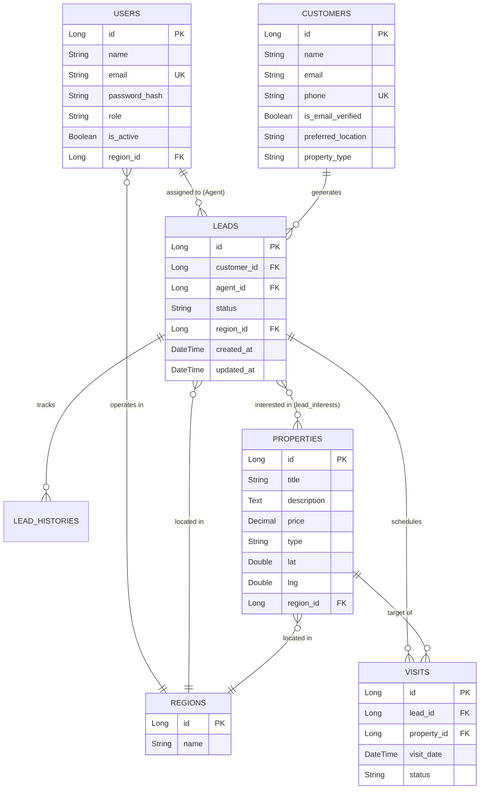
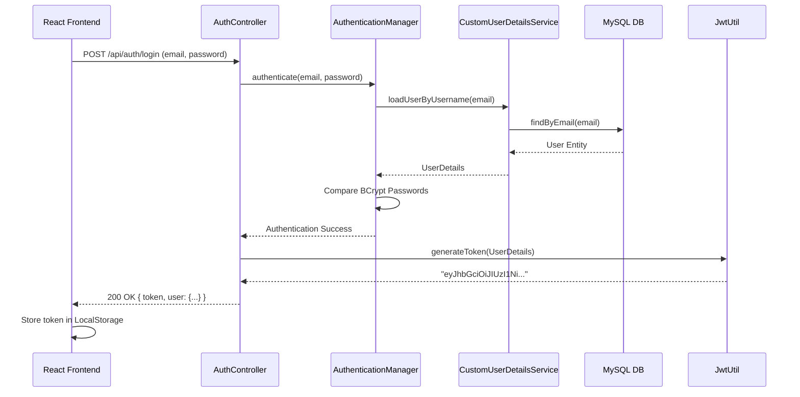
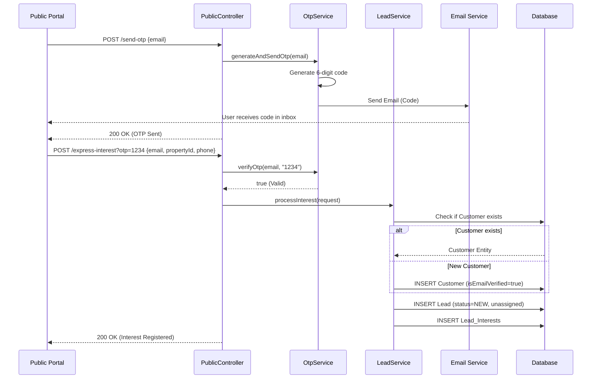
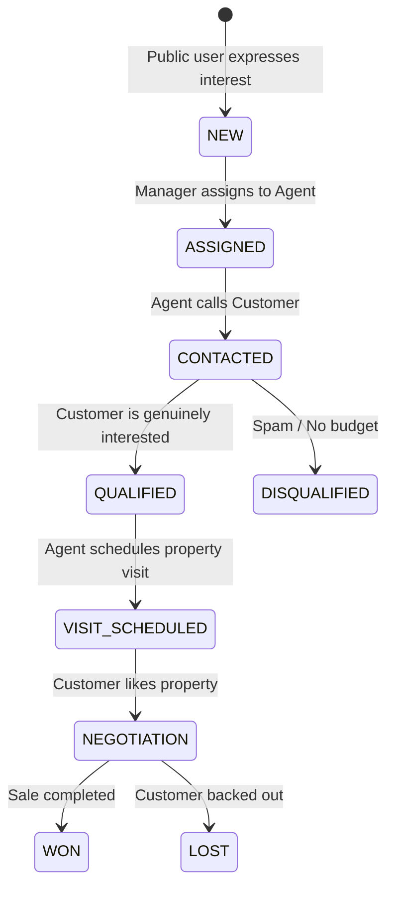

# Comprehensive Project Design & Architecture Report
**Project Name:** EstateSync (CRMS1)
**Document Type:** Software Design Document (SDD) & Architectural Report
**Date:** July 2026

---

# Table of Contents
1. [Executive Summary & Introduction](#1-executive-summary--introduction)
2. [High-Level System Architecture](#2-high-level-system-architecture)
3. [Database Architecture & Entity-Relationship Design](#3-database-architecture--entity-relationship-design)
4. [Backend (Spring Boot) Architecture](#4-backend-spring-boot-architecture)
5. [Frontend (React + Vite) Architecture](#5-frontend-react--vite-architecture)
6. [Security & Authentication Flow](#6-security--authentication-flow)
7. [Core Business Workflows & Sequence Diagrams](#7-core-business-workflows--sequence-diagrams)
8. [API Contract & Integration Design](#8-api-contract--integration-design)
9. [Deployment & Build Strategy](#9-deployment--build-strategy)

---

## 1. Executive Summary & Introduction

### 1.1 Purpose
This comprehensive Software Design Document (SDD) outlines the architecture, system design, and underlying data models of the **EstateSync (CRMS1)** application. The document serves as the single source of truth for developers, architects, and stakeholders to understand the internal mechanics, deployment strategies, and business workflows of the platform.

### 1.2 Scope
EstateSync is an enterprise-grade Customer Relationship Management (CRM) system tailored for the real estate industry. It facilitates property listings for public users, lead generation via OTP-verified interest expressions, and an internal portal for agents, managers, and administrators to track the sales pipeline, manage properties, and schedule visits.

### 1.3 Target Audience
- **Software Engineers:** For understanding the exact implementation details and API contracts.
- **System Architects:** For analyzing the security, scalability, and deployment topologies.
- **Product Managers:** For understanding the business rules encoded into the system.

---

## 2. High-Level System Architecture

The system follows a modernized **3-Tier Client-Server Architecture** separating the presentation layer, the application logic layer, and the data persistence layer.

### 2.1 Technology Stack
- **Frontend (Client):** React 19, Vite, React Router, Tailwind CSS, Axios, Leaflet (Mapping).
- **Backend (Server):** Java 17, Spring Boot 3.x, Spring Security, Spring Data JPA, Hibernate, JWT.
- **Database:** MySQL.
- **Database Migration:** Flyway.

### 2.2 System Context Diagram

The following Mermaid diagram illustrates the high-level context of how different actors interact with the EstateSync platform.



### 2.3 Architectural Principles
1. **Statelessness:** The backend REST API is strictly stateless. All session state is maintained on the client-side via JSON Web Tokens (JWT).
2. **Role-Based Access Control (RBAC):** Every API endpoint and UI route is strictly guarded by roles (`ADMIN`, `MANAGER`, `AGENT`, `PUBLIC`).
3. **Separation of Concerns:** The backend is divided into Controllers (HTTP routing), Services (business logic), and Repositories (data access).

---

## 3. Database Architecture & Entity-Relationship Design

The relational database is designed in MySQL and managed via Flyway migration scripts. It is heavily normalized to 3NF to ensure data integrity.

### 3.1 Entity-Relationship Diagram (ERD)



### 3.2 Data Dictionary & Normalization Strategy
- **Users Table:** Stores internal staff. The `password_hash` utilizes BCrypt. The `role` column acts as the primary driver for authorization.
- **Customers Table:** Stores external prospects. The `is_email_verified` flag ensures that leads generated from the public portal are legitimate via OTP.
- **Leads Table:** The core transactional table. A Lead acts as the binding entity between a Customer, an Agent, and a set of Properties.
- **Lead Interests:** A join table resolving the Many-to-Many relationship between Leads and Properties, allowing a single lead to track interest in multiple listings simultaneously.

---

## 4. Backend (Spring Boot) Architecture

The backend follows a classic layered architecture pattern.

### 4.1 Layered Architecture Flowchart

```mermaid
flowchart LR
    Client((React Frontend)) -->|HTTP Request| Controller[Controllers\n@RestController]
    Controller -->|DTOs| Service[Services\n@Service]
    Service -->|Entities| Repository[Repositories\n@Repository]
    Repository <-->|SQL Queries| DB[(Database)]
    
    subgraph Security Layer
        Filter[JwtAuthenticationFilter]
    end
    
    Client -.-> Filter
    Filter -.-> Controller
```

### 4.2 Core Components Definition
1. **Controllers (`com.estatesync.controller`)**: 
   - `PublicController`: Unsecured endpoints for fetching properties and submitting public inquiries.
   - `AdminController`, `ManagerController`, `AgentController`: Secured endpoints protected by `@PreAuthorize`.
2. **Services (`com.estatesync.service`)**:
   - `LeadService`: Handles complex logic like assigning leads, updating pipeline statuses, and logging history.
   - `OtpService`: Generates temporary OTPs for email verification.
3. **Repositories (`com.estatesync.repository`)**:
   - Interfaces extending `JpaRepository` providing out-of-the-box CRUD operations and dynamic query generation based on method names (e.g., `findByEmail(String email)`).

---

## 5. Frontend (React + Vite) Architecture

The frontend is a dynamic Single Page Application (SPA) utilizing a modern Vite build pipeline for rapid development.

### 5.1 Component Hierarchy & Routing

```mermaid
graph TD
    App[App.jsx - Root Router]
    AuthCtx[AuthContext Provider]
    
    App --> AuthCtx
    AuthCtx --> Router[React Router]
    
    Router --> PublicRoute[Public Routes]
    Router --> ProtectedRoute[Protected Routes layout]
    
    PublicRoute --> Home[PublicHome.jsx]
    PublicRoute --> Login[Login.jsx]
    
    ProtectedRoute --> AdminRoute[/admin/*]
    ProtectedRoute --> ManagerRoute[/manager/*]
    ProtectedRoute --> AgentRoute[/agent/*]
    
    AdminRoute --> AdminDash[AdminDashboard.jsx]
    ManagerRoute --> ManagerDash[ManagerDashboard.jsx]
    AgentRoute --> AgentDash[AgentDashboard.jsx]
```

### 5.2 State Management & Security
- **AuthContext:** Holds the `user` object and `loading` state globally.
- **Axios Interceptors:** Centralized in `services/api.js`, every outgoing HTTP request intercepts the config object, reads the JWT from `localStorage`, and injects it into the `Authorization` header.
- **Route Guards:** The `<ProtectedRoute>` component acts as a high-order component (HOC) that inspects the current user's role against an `allowedRoles` array, kicking unauthorized users back to `/login` or `/`.

---

## 6. Security & Authentication Flow

Security is heavily reliant on stateless JSON Web Tokens.

### 6.1 Authentication Sequence Diagram



### 6.2 The Filter Chain (`JwtAuthenticationFilter`)
For every subsequent request to a protected endpoint:
1. The request hits the `JwtAuthenticationFilter`.
2. The filter extracts the `Authorization: Bearer <token>` header.
3. `JwtUtil` validates the signature and checks expiration.
4. If valid, the user's details and roles are extracted from the token payload and injected into the `SecurityContextHolder`.
5. The request proceeds to the controller.

---

## 7. Core Business Workflows & Sequence Diagrams

### 7.1 Public Lead Generation Workflow (OTP Verification)
This ensures that leads entered into the CRM are from valid, verified email addresses.



### 7.2 Lead Pipeline Management (Manager -> Agent)
How a lead moves from `NEW` to `ASSIGNED` to `CONTACTED`.



---

## 8. API Contract & Integration Design

Below is a snapshot of the API contract utilizing standard RESTful conventions.

### 8.1 Public Endpoints
| Method | Endpoint | Description | Auth Required |
|--------|----------|-------------|---------------|
| `GET` | `/api/public/properties` | Fetch all active listings for the public site. | No |
| `POST` | `/api/public/send-otp` | Trigger OTP email generation for a user. | No |
| `POST` | `/api/public/express-interest` | Submit a lead, guarded by OTP verification. | No |
| `POST` | `/api/auth/login` | Authenticate an employee and receive a JWT. | No |

### 8.2 Admin & Manager Endpoints
| Method | Endpoint | Description | Auth Required |
|--------|----------|-------------|---------------|
| `GET` | `/api/admin/users` | List all staff members. | `ROLE_ADMIN` |
| `POST` | `/api/admin/users` | Provision a new staff member account. | `ROLE_ADMIN` |
| `PUT` | `/api/manager/leads/{id}/assign`| Assign an unassigned lead to an agent in the region. | `ROLE_MANAGER`|
| `GET` | `/api/manager/team-performance`| Fetch aggregate data on agent conversion rates. | `ROLE_MANAGER`|

---

## 9. Deployment & Build Strategy

### 9.1 Build Pipeline
The project utilizes a standard two-part build process.
- **Backend Build:** Maven (`mvnw clean install`). Compiles Java code, runs JUnit tests, and packages the application into an executable `.jar` file containing an embedded Tomcat server.
- **Frontend Build:** NPM/Vite (`npm run build`). Vite processes the React JSX, transpiles it, purges unused Tailwind CSS, and outputs static HTML/JS/CSS bundles into the `dist/` directory.

### 9.2 Deployment Topology (Recommended)
For production environments, the following architecture is recommended:

```mermaid
graph TD
    Internet((Internet))
    LB[Load Balancer / Reverse Proxy (Nginx)]
    
    subgraph DMZ - Web Tier
        CDN[CDN / Static Hosting]
        CDN -.->|Serves| ReactApp[React SPA Bundles]
    end
    
    subgraph Private Subnet - App Tier
        API1[Spring Boot Instance 1]
        API2[Spring Boot Instance 2]
    end
    
    subgraph Private Subnet - Data Tier
        DB[(MySQL Primary)]
        DBRep[(MySQL Replica)]
        DB -->|Async Replication| DBRep
    end

    Internet -->|HTTPS| CDN
    Internet -->|HTTPS| LB
    LB -->|Round Robin| API1
    LB -->|Round Robin| API2
    API1 -->|JDBC/TCP| DB
    API2 -->|JDBC/TCP| DB
```

### 9.3 Environment Variables
Crucial configuration points managed via `.env` (Frontend) and `application.properties` (Backend):
- **Frontend:** `VITE_API_BASE_URL` (points to the backend Load Balancer).
- **Backend:** `spring.datasource.url`, `jwt.secret`, `jwt.expiration`, `spring.mail.password`.

---

# Conclusion
The EstateSync (CRMS1) architecture provides a highly scalable, secure, and modern foundation. By separating the Vite-powered React frontend from the Spring Boot REST API, the system achieves maximum flexibility. The robust RBAC security model ensures data privacy across regions and roles, while the normalized MySQL database provides absolute transactional integrity for real estate sales pipelines.
